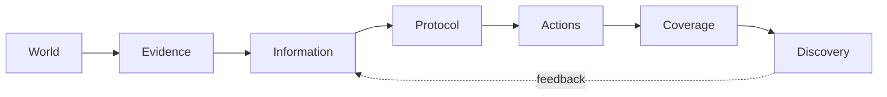

# Foundations of Distributed Discovery — DD-000

## 1. Purpose and evidence status

Distributed Discovery is the working name for the study of how organizations or multi-agent systems convert dispersed evidence into a finite portfolio of search actions. The name is not asserted to be a new field or unique phrase: M2 found prior uses in resource/service discovery, news discovery, and a March 2026 autonomous-science preprint. The framework below is a synthesis and research program, not a novelty claim.

The Shared Discovery Paradox remains the canonical atomic result. Its evidence is pinned and reproduced in `reports/baseline-reproduction.md`. Definitions in this document are DD-000 working definitions. The Information–Action Decomposition is an accounting identity (DD-C-0002); the redundancy identity has a local proof (DD-C-0011). Generalizations not explicitly proved remain research questions.

## 2. The primitive problem

A distributed discovery problem is represented by

\[
\mathcal D=(\Omega,\mu,E,I,A,\Gamma,B,\tau,R).
\]

- \(\Omega\) is a finite or measurable set of possible worlds.
- \(\mu\) is a prior probability measure on \(\Omega\).
- \(E\) is an evidence-generating kernel, including dependence and provenance.
- \(I\) is an information architecture: which evidence, messages, and histories are available to which decision makers at each time.
- \(A=A_1\times\cdots\times A_N\) is the joint feasible action space, possibly constrained by roles.
- \(\Gamma\) maps a world and a set, multiset, or sequence of actions to covered/discovered outcomes.
- \(B\) is the feasible action/resource budget, not necessarily a scalar count.
- \(\tau\) specifies timing, observation, feedback, adaptation, and stopping.
- \(R\) specifies rewards, credit, and utilities. It is separate from the social discovery objective.

A discovery architecture is \(\mathcal H=(I,\Pi,R)\). The action protocol \(\Pi\) is a stochastic kernel from information histories to feasible joint actions:

\[
\Pi:\mathcal H_I\longrightarrow \Delta(A_1\times\cdots\times A_N).
\]

This definition covers centralized assignment, ex-ante team policies, equilibrium selection, independent local rules, and adaptive policies, provided their feasibility and information are explicit.

## 3. Discovery value and the information frontier

For a static common-objective problem, let \(S_\Pi\) be the action set or multiset induced by world, evidence, protocol randomization, and any agent randomization. Let bounded \(v_\omega(S)\) state the realized discovery value. Define

\[
G_B(\Pi;I)=\mathbb E_{\omega\sim\mu,E,\Pi}[v_\omega(S_\Pi)].
\]

For a declared feasible protocol class \(\mathcal P_B(I)\), define the information frontier

\[
V_B(I)=\sup_{\Pi\in\mathcal P_B(I)}G_B(\Pi;I).
\]

The frontier is always relative to the action technology, budget, timing, objective, and allowed institutional authority. Calling it an “information” frontier does not mean information alone determines it.

For feasible \(\Pi\), define protocol loss

\[
L_B(\Pi;I)=V_B(I)-G_B(\Pi;I)\ge0.
\]

Therefore

\[
\boxed{G_B(\Pi;I)=V_B(I)-L_B(\Pi;I).}
\]

This Information–Action Decomposition is an accounting identity by definition, not an independent performance theorem. It becomes analytically useful only when the frontier or loss can be characterized or bounded.

### Information monotonicity

If architecture \(I_2\) can emulate every feasible \(I_1\)-protocol without changing the action/budget constraints, then \(V_B(I_2)\ge V_B(I_1)\): the richer architecture may ignore its additional information. This is a frontier statement. It does **not** imply \(G_B(\Pi_2;I_2)\ge G_B(\Pi_1;I_1)\) when the implemented protocol changes. That gap is the mechanism behind the canonical paradox and the disclosure question in DD-002. Blackwell’s ordering is adjacent decision-theoretic language, but strategic multi-agent implementation requires additional assumptions.

## 4. Atomic one-target special case

Let \(\theta\in\Omega=\{1,\ldots,M\}\) be one target and each action select one location. Then

\[
v_\theta(S)=\mathbf 1\{\theta\in S\},\qquad
G_B(\Pi;I)=\Pr(\theta\in S_\Pi).
\]

With pooled posterior \(\pi\) and authority to assign at most \(L\) distinct locations, conditional value is the sum of the \(L\) largest posterior masses. The upstream paper’s \(V_L(\mathcal F)\) is this special case of \(V_B(I)\). Outside atomic modular coverage, top-\(L\) ranking need not be optimal; DD-005 must state the coverage assumptions and any approximation guarantees.

## 5. Quality, coverage, and redundancy

For \(N\) atomic actions \(A_i\), define average action quality

\[
Q(\Pi)=\frac1N\sum_{i=1}^N\Pr(A_i=\theta).
\]

Let \(K=\sum_i\mathbf1\{A_i=\theta\}\). Then \(NQ=\mathbb E[K]\), while discovery is \(G=\Pr(K\ge1)\). Hence

\[
NQ-G=\mathbb E[(K-1)^+].
\]

This exact identity (DD-C-0011) counts successful actions beyond the first, not every duplicate action. An action can duplicate an incorrect choice without contributing to the right-hand side. Consequently, keep these distinct:

- **Action redundancy:** a declared collision/overlap functional on the action portfolio.
- **Redundant hits:** \(\mathbb E[(K-1)^+]\) in the one-target atomic model.
- **Distinct actions:** number of unique action labels; a descriptive coverage proxy only in atomic models.
- **Action concentration:** a distributional concentration index (for example, Herfindahl concentration) whose estimator must be stated.

The Shared Discovery Paradox occurs when a shared-information protocol raises \(Q\) and lowers \(G\) relative to a comparison protocol. It is not merely any case in which communication harms welfare.

## 6. Budgets and diagnostic quantities

### Discovery and recovery budgets

The discovery budget \(B\) records the feasible resource constraint. For scalar action count \(L\) and benchmark value \(g_0\), define a recovery budget

\[
L^*(I;g_0)=\min\{L:V_L(I)\ge g_0\},
\]

when the set is nonempty. The benchmark and information architecture are part of the definition. Canonically, with private clue-following as the benchmark, \(L^*=7\) (DD-C-0008).

### Communication budget

A communication budget constrains the messages or transcripts permitted before/during action. Bits are one possible measure; rounds, topology, privacy, and shared randomness may matter. DD-001’s tentative \(T_N(b)\) is not defined until the zero-communication feasible policy class is stable.

### Effective channels and source concentration

In the upstream common-cue model, if \(K\) agents copy one cue, the model-specific effective-channel count is

\[
N_{\mathrm{eff}}=N-K+\mathbf1\{K\ge1\}.
\]

This counts independent generative draws in that model. It is **not** a general effective sample size, rank, entropy, or universal channel measure. DD-003 must choose a functional for latent source networks and test invariance, identifiability, and relation to discovery. “Source concentration” is likewise provisional until the source unit and concentration index are stated.

### Discovery price of anarchy

For a fixed game and posterior, a discovery price of anarchy compares planner discovery to the worst equilibrium discovery, with the equilibrium class declared. The upstream mixed bound \(2-1/N\) applies to its equal-split covering game (DD-C-0012); it is not a universal property of discovery architectures.

## 7. Institutions: information versus assignment

| Evidence / authority | Autonomous or unassigned | Coordinated or assigned |
|---|---|---|
| Local/private evidence | Private clue-following | Private-team frontier |
| Pooled/shared evidence | Consensus or anonymous market | Planner portfolio |

Comparing within a row changes action assignment while holding information access closer to fixed. Comparing within a column changes information access while holding authority closer to fixed. The canonical planner/private comparison changes both, so it cannot uniquely identify the value of pooling. DD-001 fills the missing private-team cell with ex-ante role policies and no action-time communication.

This matrix separates four questions:

1. value of information sharing;
2. value of ex-ante or ex-post action assignment;
3. cost of autonomous incentives/equilibrium selection;
4. cost of compressing a portfolio into one answer.

## 8. Mapping the canonical benchmark

| Canonical object/result | General-framework interpretation | Evidence |
|---|---|---|
| Consensus | pooled information, one-answer autonomous protocol | DD-C-0005 |
| Private clue-following | local information, unassigned heterogeneous actions | DD-C-0004 |
| Anonymous market | pooled information, strategic stochastic dispersion | DD-C-0007 |
| Planner top-eight | pooled information frontier with assignment authority | DD-C-0006 |
| Blind portfolio | assignment value without evidence use | DD-C-0003 |
| Recovery budget 7 | capacity required for pooled frontier to meet private benchmark | DD-C-0008 |
| Redundancy identity | atomic link between action quality and union discovery | DD-C-0011 |
| Market/private crossover | model-specific response to common-cue dependence | DD-C-0009 |
| Effective channels | count of independent draws in upstream copying process | DD-C-0014 context; provisional generally |
| Price of anarchy | equilibrium allocation loss in one reward game | DD-C-0012 |
| Sole-rescue result | marginal-coverage reward implementation under stated assumptions | DD-C-0013 |

## 9. Pipeline and extensions

The atomic benchmark suppresses many links. DD-001 changes local information and role assignment; DD-002 designs disclosure before strategic action; DD-003 changes evidence provenance/dependence; DD-004 activates feedback and timing; DD-005 changes coverage value; DD-006 makes rewards/reporting strategic; DD-007 estimates diagnostics from data.

## 10. Boundaries and open questions

- A richer information architecture weakly expands a frontier only under an emulation condition; implemented discovery may fall when the protocol changes.
- Protocol loss is benchmark-relative and can be empirically unidentified without a posterior/coverage model.
- Repeated actions need not be wasteful under robustness, multiple targets, noisy execution, or non-atomic coverage.
- Correlation is not provenance: equal pairwise correlations can arise from different latent source networks.
- Static modular results do not automatically extend to submodular, adaptive, strategic, or multi-target problems.
- The phrase “Distributed Discovery” has existing uses; claims must define the present action-allocation meaning explicitly.
